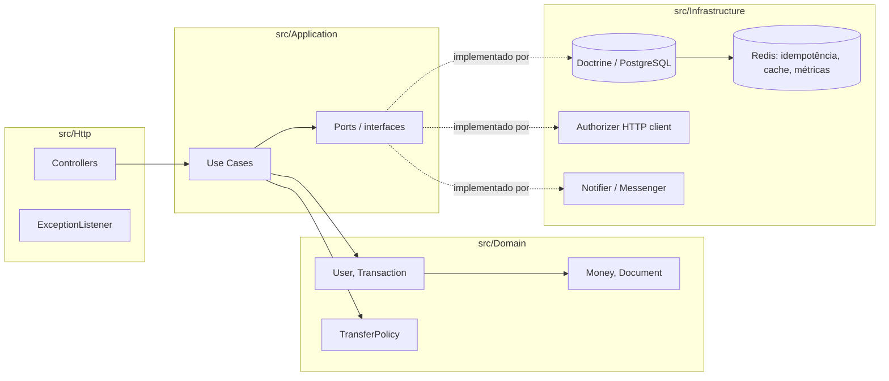

# PicPay Simplificado

Serviço de transferências entre usuários e lojistas — implementação do desafio técnico
back-end, com foco no único fluxo que ele avalia de fato: `POST /transfer`.

## Stack e por quê

**PHP 8.4 + Symfony 8.1**, sem `symfony/webapp` (só os componentes de uma API), PostgreSQL 16,
Redis, FrankenPHP como runtime, tudo containerizado.

O próprio README do desafio dá pistas fortes de que PHP é o eixo esperado (PSR-12, PHPMD,
PHP-CS-Fixer, PHPStan citados nominalmente) e pede explicitamente para evitar excesso de
"atalhos mágicos" — Symfony, com injeção de dependência explícita e sem Active Record, se presta
melhor a isso do que Laravel/Eloquent. Os componentes usados (Messenger, HttpClient com retry,
Cache, RateLimiter, Validator) cobrem os diferenciais pedidos (fila, cache, resiliência) sem
reinventar essa infraestrutura na mão, sobrando tempo para a modelagem de domínio em si.

## Arquitetura

Monolito modular, hexagonal (ports & adapters) — não microsserviços. A razão dessa escolha,
e o que mudaria se o domínio crescesse, está em
[`docs/adr/0001-hexagonal-architecture.md`](docs/adr/0001-hexagonal-architecture.md).



A dependência aponta sempre para dentro: `Http`/`Infrastructure` conhecem `Application`, que
conhece `Domain` — nunca o contrário. `Domain` não importa nada de fora dele mesmo.

Decisões específicas, com o raciocínio e os trade-offs, estão em `docs/adr/`:

| ADR | Decisão |
|---|---|
| [0001](docs/adr/0001-hexagonal-architecture.md) | Monolito modular hexagonal, não microsserviços |
| [0002](docs/adr/0002-money-as-integer-cents.md) | Dinheiro como `int` (centavos), nunca `float` |
| [0003](docs/adr/0003-wallet-is-not-an-entity.md) | Saldo embutido em `User`, não uma entidade `Wallet` — com o bug real de PostgreSQL que motivou a mudança |
| [0004](docs/adr/0004-external-mocks-tls.md) | TLS desligado só nos dois clients dos mocks (certificado expirado, verificado à mão) |
| [0005](docs/adr/0005-observability-scope.md) | Escopo de observabilidade: logs + health + um contador, sem stack completa |
| [0006](docs/adr/0006-fail-closed-authorizer-async-notification.md) | Autorizador fail-closed; notificação sempre assíncrona e best-effort |

## Como rodar

Requer apenas Docker.

```bash
make up          # sobe app, worker, PostgreSQL, Redis
make migrate      # aplica as migrations
```

A API fica em `http://localhost:8080`. `make help` lista todos os atalhos disponíveis
(`make sh`, `make logs`, `make test`, `make stan`, ...).

Sem `make` instalado, os comandos equivalentes usam `docker compose exec app ...` — o
`Makefile` é só um atalho para eles, cada alvo mostra o comando real.

### Fluxo de exemplo

```bash
# cadastro de um usuário comum e de um lojista (fora do escopo avaliado, mas necessário
# para ter alguém que envie e alguém que receba)
curl -X POST localhost:8080/users -H 'Content-Type: application/json' -d '{
  "fullName": "Ana Silva", "document": "52998224725",
  "email": "ana@example.com", "password": "supersecret", "type": "common"
}'
curl -X POST localhost:8080/users -H 'Content-Type: application/json' -d '{
  "fullName": "Loja da Ana", "document": "11444777000161",
  "email": "loja@example.com", "password": "supersecret", "type": "merchant"
}'

# depósito (endpoint proposto, não avaliado — ver seção "Endpoint de transferência" abaixo)
curl -X POST localhost:8080/users/1/deposit -H 'Content-Type: application/json' -d '{"value": 500.00}'

# o endpoint que o desafio avalia, no contrato exato pedido
curl -X POST localhost:8080/transfer -H 'Content-Type: application/json' -d '{
  "value": 100.0, "payer": 1, "payee": 2
}'
```

O autorizador mock alterna aleatoriamente entre autorizar e negar — rodar o `curl` de
transferência algumas vezes mostra os dois fluxos (`201` e `403 transfer_not_authorized`).

## Endpoints

`POST /transfer` é o único endpoint que o desafio de fato avalia; contrato fixo
(`value`, `payer`, `payee`) mantido exatamente como especificado. Os demais existem para tornar
esse fluxo demonstrável de ponta a ponta.

| Método | Rota | Avaliado? | Descrição |
|---|---|---|---|
| `POST` | `/transfer` | **Sim** | Transferência entre dois usuários |
| `POST` | `/users` | Não | Cadastro (README: "fluxo de cadastro não será avaliado") |
| `GET` | `/users/{id}` | Não | Consulta de usuário/saldo |
| `POST` | `/users/{id}/deposit` | Não | Deposita saldo — proposta própria, ver abaixo |
| `GET` | `/health/live` / `/health/ready` | Não | Liveness / readiness |
| `GET` | `/metrics` | Não | Contadores Prometheus |

Especificação completa (request/response, todos os códigos de erro) em
[`docs/openapi.yaml`](docs/openapi.yaml).

### Sobre o endpoint de depósito

O enunciado abre dizendo "é possível depositar e realizar transferências", mas só especifica o
contrato de transferência. Sem alguma forma de colocar saldo numa carteira, `/transfer` não tem
como ser demonstrado de ponta a ponta — por isso `POST /users/{id}/deposit` existe, deliberadamente
mínimo (sem origem de fundos, sem meio de pagamento real). Justificativa completa no código
(`DepositMoneyUseCase`).

## Regras de negócio implementadas

- Nome completo, CPF **ou** CNPJ (validados por dígito verificador, não só formato/tamanho) e
  e-mail únicos — tanto pré-checados na aplicação quanto garantidos por índice único no banco
  (a segunda camada é o que resolve a corrida entre duas requisições simultâneas de cadastro
  com os mesmos dados).
- Lojista só recebe: `payer` do tipo `merchant` é rejeitado com `403`.
- Saldo insuficiente é validado antes de qualquer chamada externa.
- Autorizador externo é sempre consultado antes de mover dinheiro; indisponibilidade do
  autorizador é tratada como recusa (fail-closed) — ver [ADR 0006](docs/adr/0006-fail-closed-authorizer-async-notification.md).
- A transferência inteira (bloqueio de linhas, débito, crédito, gravação da transação) roda em
  uma única transação de banco: qualquer falha reverte tudo, o saldo do pagador nunca fica
  inconsistente.
- Duas transferências simultâneas do mesmo pagador nunca resultam em saldo negativo — lock
  pessimista (`SELECT ... FOR UPDATE`), sempre adquirido em ordem crescente de id para nunca
  gerar deadlock entre duas transferências que se cruzam. Prova disso, contra PostgreSQL real,
  em `tests/Integration/Persistence/ConcurrentTransferLockTest.php`.
- Notificação ao recebedor é assíncrona (fila via Symfony Messenger) e nunca pode desfazer ou
  atrasar uma transferência já concluída.
- `Idempotency-Key` (header opcional) evita duplicar uma transferência em caso de retry do
  cliente.

## Testes

```bash
make test              # suíte completa
make test-unit         # só Domain/Application, sem banco (rápido)
make test-integration   # repositórios/lock contra PostgreSQL real
make test-functional    # HTTP fim a fim
```

67 testes, 125 assertions, três camadas:

- **Unitários** (`tests/Unit`) — value objects (inclusive validação real de CPF/CNPJ por
  dígito verificador), `TransferPolicy`, os casos de uso com fakes no lugar dos repositórios e
  gateways externos.
- **Integração** (`tests/Integration`) — repositórios Doctrine contra PostgreSQL real (não
  SQLite: unique constraints, embeddables e locks se comportam diferente o suficiente entre
  bancos para que testar contra outro banco seria testar outra coisa), incluindo o teste de
  concorrência do lock pessimista.
- **Funcionais** (`tests/Functional`) — `POST /transfer` e `POST /users` fim a fim via HTTP,
  com o autorizador e o notificador reais substituídos por fakes determinísticos
  (`config/services_test.yaml` — nunca faz sentido um teste automatizado depender da
  disponibilidade ou do resultado aleatório de um serviço externo).

Isolamento: cada teste roda dentro de uma transação que é revertida ao final
(`dama/doctrine-test-bundle`), exceto o teste de concorrência, que precisa de duas conexões
de banco genuinamente independentes e por isso usa `#[SkipDatabaseRollback]` com limpeza manual.

## Qualidade

```bash
make cs-check   # PHP-CS-Fixer (PSR-12 + regras risky), sem modificar arquivos
make stan       # PHPStan, nível max
make quality    # os dois + testes — o mesmo que o CI roda
```

Ambos limpos. `PHPMD` (sugerido no README do desafio) foi tentado e documentado como
inviável no momento: a versão atual (2.15) depende de `pdepend` ^2.16, que por sua vez exige
`symfony/config` até ^7 — incompatível com o Symfony 8.1 deste projeto; a versão antiga (2.5,
de 2016) não roda em PHP 8.4. `make phpmd` existe e funciona via a imagem `jakzal/phpqa`
(isolada do `composer.lock` do projeto, portanto sem esse conflito) sempre que houver acesso
à internet para baixá-la.

## CI

`.github/workflows/ci.yml`: lint (PHP-CS-Fixer) → análise estática (PHPStan) → suíte completa
de testes com PostgreSQL e Redis reais como serviços do job → build da imagem de produção
(prova que a imagem builda limpo, sem publicar).

## Observabilidade e segurança

- Logs estruturados em JSON (Monolog, saída em `stderr` em produção).
- `GET /health/live`, `GET /health/ready` (checam PostgreSQL e Redis de verdade).
- `GET /metrics` — contador Prometheus de transferências por resultado.
- Rate limiting em `POST /transfer` (30 req/min por IP).
- Senhas com hash (`password_hash`, mesmo o fluxo de autenticação estando fora de escopo).
- Erros nunca vazam stack trace: `App\Http\EventListener\ExceptionListener` centraliza toda
  resposta de erro em `application/problem+json` (RFC 7807).
- Detalhes de cada decisão de segurança/observabilidade nos ADRs 0004–0006.

## O que eu faria com mais tempo

- Mutation testing (Infection) para validar a qualidade dos próprios testes, não só a
  cobertura de linha.
- Circuit breaker de verdade no client do autorizador (hoje só timeout curto + retry) para
  parar de tentar por um tempo depois de falhas consecutivas, em vez de tentar a cada request.
- Publicar `/api/docs` servindo o `openapi.yaml` (hoje é só um arquivo estático) —
  descartei `NelmioApiDocBundle` por instabilidade de configuração fora do tempo disponível,
  preferindo um spec correto e mantido à mão a um autogerado mal configurado.
- Outbox pattern completo para a notificação (hoje a garantia vem do transporte Doctrine do
  Messenger, que já sobrevive a restart do worker, mas não é literalmente a mesma transação do
  débito/crédito).

## Checklist de aderência ao desafio

- [x] Nome completo, CPF/CNPJ, e-mail, senha — CPF/CNPJ e e-mail únicos
- [x] Usuários comuns enviam para lojistas e entre si; lojistas só recebem
- [x] Validação de saldo antes da transferência
- [x] Consulta ao autorizador externo (mock) antes de concluir
- [x] Transferência transacional, com reversão em qualquer inconsistência
- [x] Notificação assíncrona ao recebedor, tolerante à instabilidade do serviço mock
- [x] API RESTful, contrato de `POST /transfer` exatamente como especificado
- [x] Docker / docker compose
- [x] Cobertura de testes (unit + integração + funcional, 67 testes)
- [x] Design patterns (repository, ports & adapters, factory methods em Money/Document, policy object)
- [x] Documentação (este README, OpenAPI, 6 ADRs)
- [x] Proposta de melhoria de arquitetura e evolução (seção acima + ADRs)
- [x] Modelagem de dados (`docs/adr/0002`, `0003`)
- [x] Tratamento de erros (RFC 7807 em toda a API)
- [x] Segurança (hash de senha, TLS documentado, rate limiting)
- [x] CI rodando testes e análise estática
- [x] Cache (Redis: idempotência, rate limiter)
- [x] Mensageria (Symfony Messenger)
- [x] Noções de escalabilidade (lock pessimista com ordenação anti-deadlock, worker separado do request HTTP)
